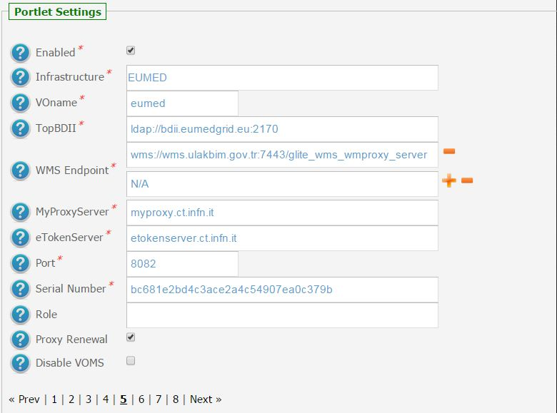
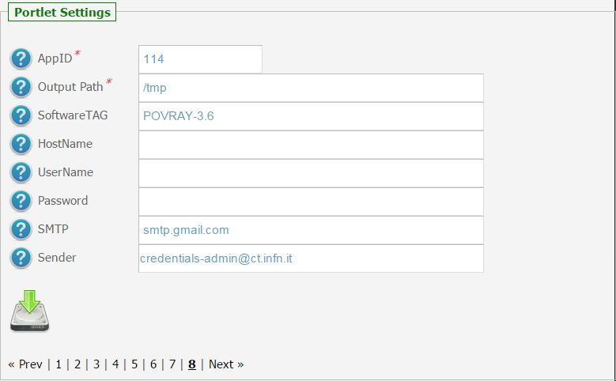
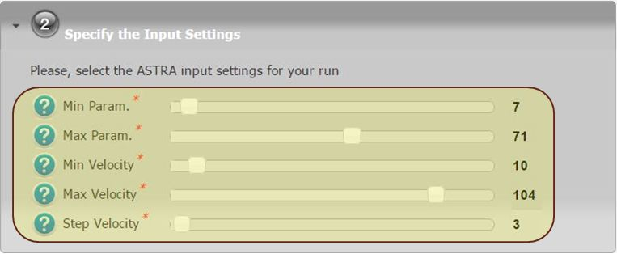
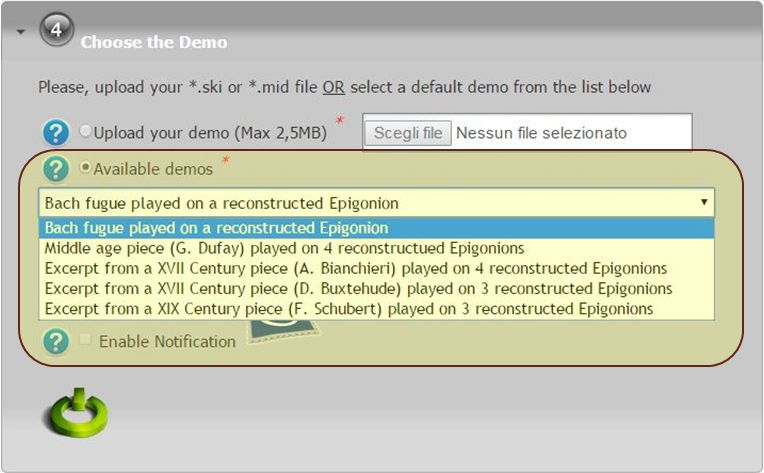

*********************
ASTRA v1.8.4 Docs
*********************

============
About
============

-------------

.. _ASTRA: http://www.astraproject.org/
.. _GEANT: www.geant.net
.. _PMS: http://www.cim.mcgill.ca/~clark/nordmodularbook/nm_physical.html

The ASTRA_ project aims to reconstruct the sound or timbre of ancient instruments (not existing anymore) using archaeological data as fragments from excavations, written descriptions, pictures, etc.

The technique used is the Physical Modeling Synthesis (PMS_), a complex digital audio rendering technique which allows modeling the time-domain physics of the instrument. In other words the basic idea is to recreate a model of the musical instrument and produce the sound by simulating its behavior as a mechanical system.

The application would produce one or more sounds corresponding to different configurations of the instrument (i.e. the different notes). The project runs since 2006 thanks to the GEANT backbone and to computing resources located in Europe and in other regions of the world, allowing researchers, musicians and historians to collaborate, communicate and share experiencies on lost instruments and sounds ASTRA brings again to life.

============
Installation
============
To install this portlet the WAR file has to be deployed into the application server.

As soon as the portlet has been successfully deployed on the Science Gateway the administrator has to configure:

- the list of e-Infrastructures where the application can be executed;

- some additional application settings.

1.) To configure a generic e-Infrastructure, the following settings have to be provided:

**Enabled**: A true/false flag which enables or disable the generic e-Infrastructure;

**Infrastructure**: The acronym to reference the e-Infrastructure;

**VOName**: The VO for this e-Infrastructure;

**TopBDII**: The Top BDII for this e-Infrastructure;

**WMS Endpoint**: A list of WMS endpoint for this e-Infrastructure (max. 10);

**MyProxyServer**: The MyProxyServer for this e-Infrastructure;

**eTokenServer**: The eTokenServer for this e-Infrastructure;

**Port**: The eTokenServer port for this e-Infrastructure;

**Serial Number**: The MD5SUM of the robot certificate to be used for this e-Infrastructure;

In the following figure is shown how the portlet has been configured to run simulation on the EUMEDGRID-Support e-Infrastructure.

2.) To configure the application, the following settings have to be provided:

**AppID**: The ApplicationID as registered in the UserTracking MySQL database (GridOperations table);

**Software TAG**: The list of software tags requested by the application;

**SMTP Host**: The SMTP server used to send notification to users;

**Sender**: The FROM e-mail address to send notification messages about the jobs execution to users;

.. _CHAIN-REDS: https://science-gateway.chain-project.eu/

In the figure below is shown how the application settings have been configured to run on the CHAIN-REDS_ Science Gateway.

============
Usage
============

.. _Epigonion: https://www.youtube.com/watch?v=YZ6JNzD2TM4

To run a molecular dynamics simulations with ASTRA_ the user has to:

- click on the *second* accordion of the portlet and,

- select settings for the generation of the digital libraries as shown in the below figure:

- click on the *third* accordion of the portlet and,

- select the input file (e.g. *.ski* or *.mid* files) OR select a demo from the list as shown in the below figure:

Each molecular dynamic simulation will produce:

- *std.txt*: the standard output file;

- *std.err*: the standard error file;

- *.wav*: a MIDI file about an opera played using the Epigonion_;

- *.tar.gz*: containing the sound libraries of each singular string of the Epigonion_.

A typical simulation produces, at the end, the following files:

.. code:: bash

        ]$ tree ASTRASimulationStarted_14723/

============
References
============

.. _1: https://www.youtube.com/watch?v=YZ6JNzD2TM4
.. _2: http://agenda.ct.infn.it/event/1110/

* CHAIN-REDS Conference: *"Open Science at the Global Scale: Sharing e-Infrastructures, Sharing Knowledge, Sharing Progress"* – March 31, 2015 – Brussels, Belgium [2_];

============
Support
============
Please feel free to contact us any time if you have any questions or comments.

.. _INFN: http://www.ct.infn.it/
.. _DANTE: http://www.dante.net/

:Authors:
 `Giuseppe LA ROCCA <mailto:giuseppe.larocca@ct.infn.it>`_ - Italian National Institute of Nuclear Physics (INFN_),
 
`Roberto BARBERA <mailto:roberto.barbera@ct.infn.it>`_ - Italian National Institute of Nuclear Physics (INFN_),

 `Domenico VICINANZA <mailto:mario.torrisi@ct.infn.it>`_ - DANTE (DANTE_),

:Version: v1.8.4, 2015

:Date: May 29th, 2015 16:54
